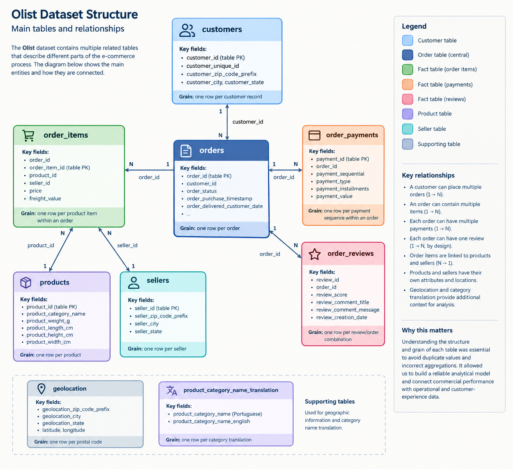

# 2. Data Understanding

Before writing the analytical queries, I first looked at how the Olist dataset was structured and, more importantly, what each table actually represented.

The dataset is not one large sales table. It is a collection of related tables describing different parts of the e-commerce process: customers place orders, orders contain items, items belong to products and sellers, payments are recorded separately, and customers can leave reviews.

Understanding these relationships was important because combining tables without considering their level of detail can easily produce incorrect results.

---

## 2.1 Main Dataset Components

The Olist dataset contains several related entities:

| Table                               | What it represents                           |
| ----------------------------------- | -------------------------------------------- |
| `customers`                         | Customer records and customer location       |
| `orders`                            | Order lifecycle and timestamps               |
| `order_items`                       | Products purchased within each order         |
| `products`                          | Product characteristics and categories       |
| `sellers`                           | Seller information and location              |
| `order_payments`                    | Payments associated with orders              |
| `order_reviews`                     | Customer reviews and ratings                 |
| `geolocation`                       | Brazilian postal-code geographic information |
| `product_category_name_translation` | Portuguese-to-English category names         |

The most important point is that these tables do **not** all have the same grain.

### Olist Dataset Structure

The following diagram summarizes the main tables and their relationships within the original Olist dataset.


---

## 2.2 Understanding Table Grain

One of the first decisions in the project was to identify the grain of each table before performing analytical joins.

For example, an order can contain several products:

```text
Order 1001
│
├── Product A
├── Product B
└── Product C
```

Therefore, one order can produce multiple rows in `order_items`.

If an order-level value such as a payment amount or review score is joined directly to those three item rows, the same value can appear three times.

This can lead to inflated totals and misleading averages.

The same issue exists between other tables.

For this reason, I treated the grain of each fact table explicitly:

| Analytical table  | Grain                                        |
| ----------------- | -------------------------------------------- |
| `fact_order_item` | One row per product item within an order     |
| `fact_payment`    | One row per payment sequence within an order |
| `fact_review`     | One row per review/order combination         |

This decision became one of the foundations of the analytical model.

---

## 2.3 The Order as the Central Business Process

The order is the main business process connecting many parts of the dataset.

Conceptually:

```text
Customer
   │
   ▼
 Order
   │
   ├──────────► Payments
   │
   ├──────────► Reviews
   │
   └──────────► Order Items
                    │
                    ├──► Product
                    │
                    └──► Seller
```

This structure allows the analysis to connect commercial performance with operational and customer-experience information.

For example, an order can be used to connect:

**what was purchased → who sold it → how much it generated → how it was delivered → how the customer reviewed the experience.**

That connection is what makes the dataset useful for business analysis rather than only descriptive reporting.

---

## 2.4 Questions I Considered Before Modeling

Before creating the analytical tables, I focused on several questions:

* What is the grain of each source table?
* Which columns are genuinely unique?
* Which identifiers represent a customer, order, product or seller?
* Which tables can safely be combined?
* Which values can be duplicated as a result of a one-to-many relationship?
* Which missing values are actual data-quality problems and which are expected because of the order lifecycle?

These questions guided the data-quality checks and modeling decisions that followed.

---

## 2.5 Why This Step Matters

The biggest lesson from the dataset was that **relationships are more important than simply having clean-looking tables**.

A query can execute successfully and still produce the wrong business result if the underlying grain is misunderstood.

For example, calculating total revenue after joining order items with another one-to-many table without controlling the aggregation level can multiply the same revenue several times.

Therefore, the project treats data modeling as part of the analysis itself, not just as a preparation step before Power BI.

---

## 2.6 From Raw Data to an Analytical Model

After understanding the source tables, the next step was to investigate their quality and identify issues that could affect the analytical results.

This included duplicate identifiers, missing values, relationships between entities, date consistency and other business-rule checks.

The results of that investigation determined several important modeling decisions, which are documented in the next section.
