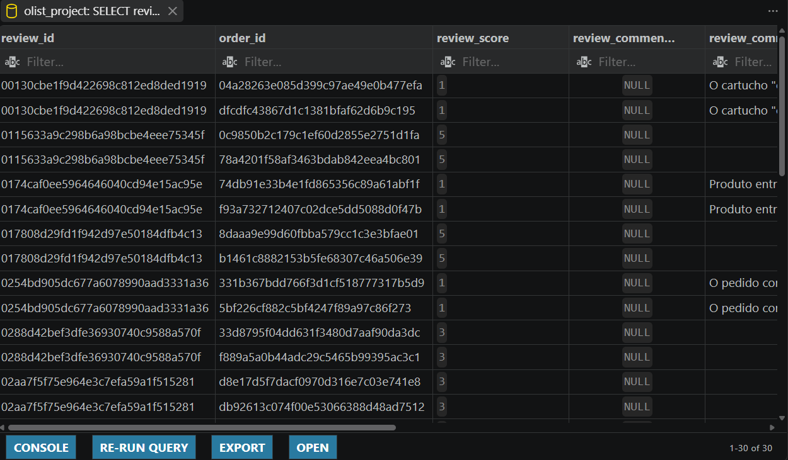

# 3. Data Quality

After understanding the structure of the dataset, the next step was to check whether the data could actually be trusted for analysis.

I did not treat every unusual value as an error. Some missing values are expected because of the order lifecycle, while other issues can create incorrect results if they are not handled properly.

The main goal of these checks was to find problems that could affect the analytical model or change the business conclusions.

---

## 3.1 Customer Identifiers

One of the first issues I investigated was the difference between `customer_id` and `customer_unique_id`.

The `customer_id` identifies a customer record within the order system, while `customer_unique_id` represents the underlying customer across different records.

This matters because the same real customer can appear with more than one `customer_id`.

I found that **252 customers were associated with more than one location** in the source data.

Instead of assuming that one location represented the customer's permanent address, I used the customer's **latest known location based on purchase activity** for the analytical customer dimension.

This gives the model one customer record while avoiding the assumption that a customer's location never changes.

---

## 3.2 Duplicate Review Identifiers

The review data required a more detailed investigation.

At first, `review_id` looked like a natural primary key. However, checking the raw data showed that it was not actually unique.

The raw `order_reviews` table contains:

* 99,224 rows
* 98,410 unique `review_id` values
* 98,673 unique `order_id` values

There were **789 duplicated `review_id` values**, representing 1,603 rows.

I then compared the duplicated records instead of simply deleting them.

The duplicated review IDs were associated with different orders, which showed that `review_id` alone was not sufficient to identify a review record in this dataset.

Because of this, the analytical review table uses:

```text
(review_id, order_id)
```

as its key.

This was an important modeling decision because simply removing duplicate `review_id` values could have removed valid review/order records.



---


## 3.3 Missing Values and Order Lifecycle

I also checked missing values in the order timeline.

Some important NULL counts in the raw `orders` table were:

| Column                          | NULL rows |
| ------------------------------- | --------: |
| `order_approved_at`             |       160 |
| `order_delivered_carrier_date`  |     1,783 |
| `order_delivered_customer_date` |     2,965 |

These values cannot automatically be classified as data errors.

For example, an order that was cancelled or never reached a certain stage may legitimately have no delivery timestamp for that stage.

Therefore, I considered the order status and lifecycle when interpreting missing dates rather than replacing NULLs or removing those rows blindly.

This is important for delivery analysis because a missing delivery date can mean that the delivery event never happened, not that the data was entered incorrectly.

---

## 3.4 Referential and Consistency Checks

Beyond individual columns, I also checked whether the relationships between tables were consistent.

The purpose was to identify issues such as:

* records referencing entities that do not exist
* unexpected duplicate keys
* invalid or inconsistent dates
* incorrect numeric values
* relationships that could create duplicated records after joins

These checks were especially important because the dataset contains several one-to-many relationships.

A query can run without producing any SQL error while still returning incorrect numbers if these relationships are not handled correctly.

---

## 3.5 What I Changed in the Analytical Model

The quality checks directly influenced the final model.

| Issue                                                       | Decision                                                                                     |
| ----------------------------------------------------------- | -------------------------------------------------------------------------------------------- |
| Multiple customer records for the same `customer_unique_id` | Use `customer_unique_id` as the analytical customer key                                      |
| Customer associated with multiple locations                 | Keep latest known location based on purchase activity                                        |
| `review_id` not unique                                      | Use `(review_id, order_id)` as the review key                                                |
| Missing delivery dates                                      | Keep NULLs where they represent an incomplete or non-applicable lifecycle event              |
| Different table grains                                      | Keep fact tables at their original analytical grain and control aggregations during analysis |

These decisions were made before building the final analytical model, so the Power BI calculations and SQL analysis were based on the cleaned and structured version of the data rather than the raw tables.

---

## 3.6 Final Data Quality Principles

The main principle I followed was simple:

> **A value should not be changed just because it looks unusual. First, understand why it exists.**

This was particularly important for the Olist dataset because some apparent problems were actually consequences of how the e-commerce process was recorded.

The data-quality stage therefore focused on understanding the business meaning behind the data, not just finding NULLs and duplicates.

After these checks, I had a better understanding of which issues needed to be corrected, which values should be preserved, and how the source data should be transformed into the analytical model.

The next step was to build that model while keeping the grain and relationships of each table under control.
