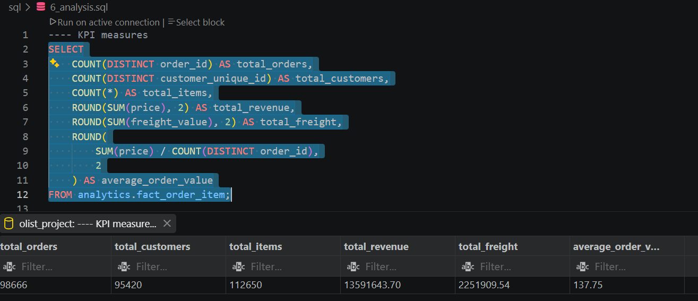

# 5. SQL Analysis

Once the analytical model was ready, I moved to the part I personally find most useful in the project: using SQL to answer actual business questions.

Instead of running random queries just to demonstrate SQL skills, I organized the analysis around questions that an e-commerce business could realistically ask.

The main areas were sales, products, sellers, customers, delivery performance and customer satisfaction.

---

## 5.1 Starting With the Overall Business

I first looked at the overall performance of the marketplace to establish a baseline.

The first questions were straightforward:

* How much revenue was generated?
* How many orders were placed?
* How many customers and sellers were involved?
* What does the overall order and delivery performance look like?

These KPIs give context to the rest of the analysis. Looking at a category or seller without knowing the overall size of the marketplace would make the result harder to interpret.





---

## 5.2 Revenue Over Time

The next step was to look at how revenue changed over time.

I used the order purchase date to group sales by time period and identify changes in marketplace activity.

This helped answer:

> **Is the marketplace growing, slowing down, or changing its sales pattern over time?**

I also kept the date logic connected to the `dim_date` table rather than creating unnecessary date fields in the fact tables.

The same time structure was later used in Power BI so that the SQL analysis and dashboard were based on consistent definitions.

---

## 5.3 Product Category Performance

Product categories were analyzed from a commercial perspective.

The main question was:

> **Which categories are responsible for the marketplace's sales, and how does their performance differ?**

I compared categories using measures such as:

* Revenue
* Number of items sold
* Customer review scores
* Freight-related costs

Looking at revenue alone is not enough. A category can generate high sales while having weaker customer satisfaction or relatively high freight costs.

This is why the category analysis was later extended beyond simple revenue ranking.

---

## 5.4 Seller Performance

I also analyzed seller performance to understand how much individual sellers contribute to the marketplace and how their operational performance differs.

The analysis considered factors such as:

* Revenue
* Number of orders/items
* Delivery performance
* Late delivery rate
* Average review score
* Freight cost relative to revenue

This made it possible to look beyond:

> **"Which sellers sell the most?"**

and instead ask:

> **"How are sellers performing across both commercial and operational metrics?"**

This distinction became especially useful later when I created the seller performance score in Power BI.

---

## 5.5 Customer Geography

The customer data also allowed me to examine where marketplace activity was concentrated.

I analyzed customers and revenue by geographic areas such as:

* State
* City

The purpose was not simply to create a map. I wanted to understand where the marketplace was generating demand and whether high customer activity also translated into high revenue.

This analysis also connects back to the earlier decision around `customer_unique_id` and latest-known customer location.

Because customer location can change, the geographic results should be interpreted as **latest-known customer locations**, not necessarily permanent residential locations.

---

## 5.6 Delivery Performance

Delivery was another major part of the analysis because the dataset contains several timestamps describing the order lifecycle.

I used these dates to examine:

* Delivery duration
* Late deliveries
* Average delay
* Delivery performance across sellers and other business dimensions

The important part here was defining delivery metrics carefully.

For example, an order without a delivery date should not automatically be treated as a delayed delivery. The order status and lifecycle have to be considered first.

This is one reason the data-quality stage was important before starting the business analysis.

---

## 5.7 Delivery Delays and Customer Satisfaction

One of the more interesting questions was whether delivery performance is connected to customer satisfaction.

I compared delivery performance with customer review scores to investigate whether orders with longer delays tended to receive different reviews.

The goal here was not to claim that delivery delays *cause* lower ratings.

Instead, the analysis asks whether there is an observable relationship in the historical data.

This distinction matters because the dataset can show patterns, but it does not contain every factor that could influence a customer's review.

---

## 5.8 Product Categories: Revenue vs. Satisfaction

I also wanted to move beyond looking at revenue and review scores separately.

For product categories, I compared:

**commercial performance**

against

**customer satisfaction**

while also considering delivery performance.

One specific analysis focused on orders that were delivered on time.

This helped answer:

> **Which product categories combine strong revenue with good customer satisfaction when delivery performance is controlled for?**

This was useful because a category with strong reviews but weak commercial performance tells a different story from a category that combines meaningful sales with strong customer experience.

---

## 5.9 Controlling the Aggregation Level

One of the most important technical points in the SQL analysis was controlling the level at which data was aggregated.

For example, `fact_order_item` contains multiple rows for an order when several products were purchased.

Reviews, however, are connected at the order level.

So before comparing order-level review information with item-level information, I had to aggregate the item data to an appropriate level first.

Conceptually:

```text
Order Items
     │
     ▼
Aggregate to Order
     │
     ▼
Combine with Review
```

This prevents one review from being counted multiple times simply because the order contained multiple products.

The same principle applies to payments and other one-to-many relationships.

---

## 5.10 From SQL Results to Business Analysis

The SQL analysis was not the final output.

I used SQL to investigate the data and establish reliable results, then used Power BI to make those results easier to explore interactively.

The overall process was:

```text
Business Question
       │
       ▼
SQL Analysis
       │
       ▼
Validate the result
       │
       ▼
Identify the business meaning
       │
       ▼
Power BI visualization
       │
       ▼
Business insight
```

This separation was useful because SQL gave me control over the data and calculations, while Power BI made the results easier to communicate.

---

## 5.11 What I Took From the SQL Analysis

The main lesson from this stage was that writing SQL is only part of the job.

The more important question is:

> **What does this result actually tell us about the business?**

For every major analysis, I tried to connect the result to a practical question instead of stopping at a table of numbers.

This also shaped the Power BI dashboard. The dashboard was not built as a collection of unrelated charts; it was built around the questions investigated during the SQL stage.

The next section focuses on how these SQL results were turned into an interactive Power BI dashboard.
