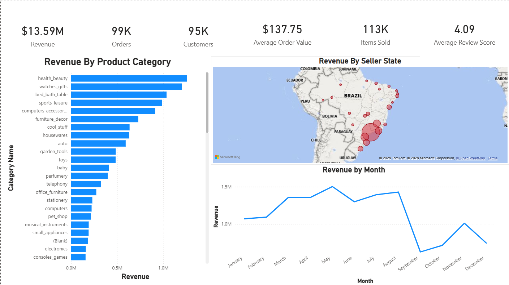
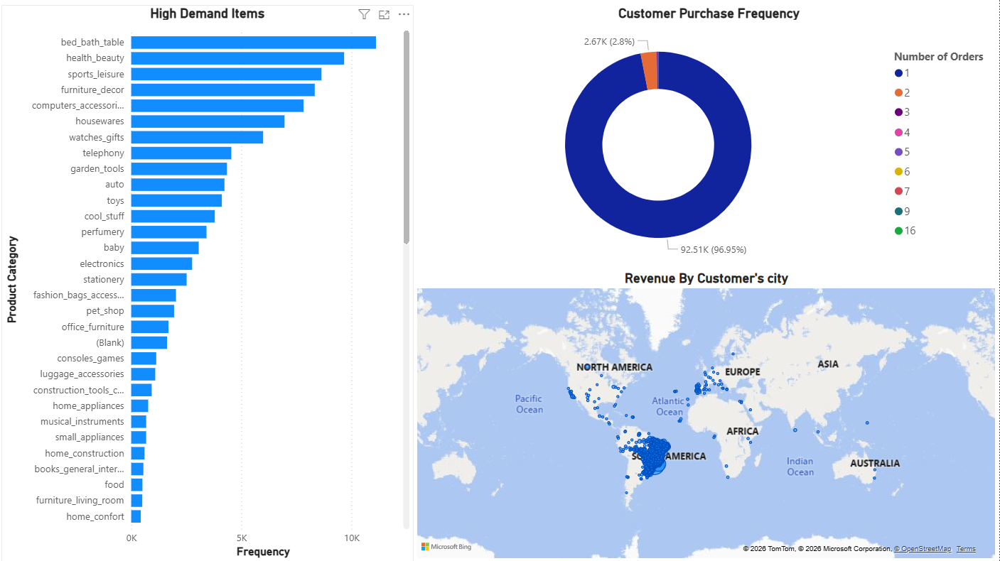
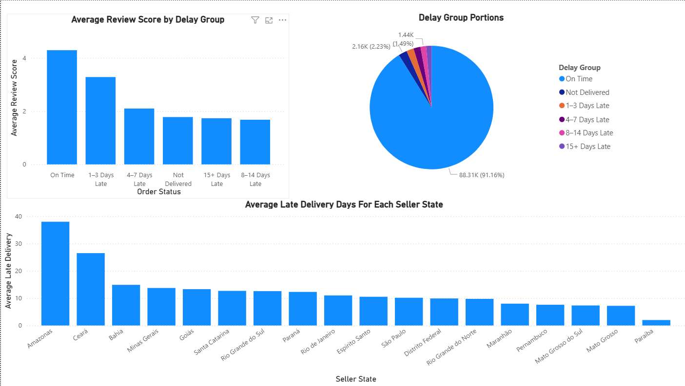
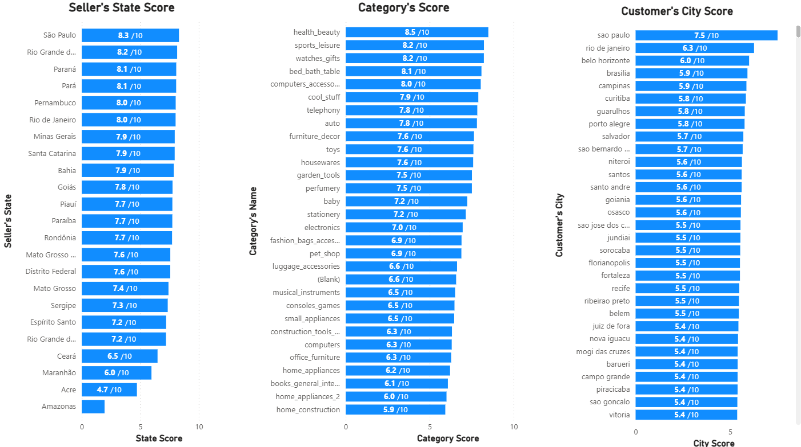

# 06 — Power BI Dashboard

After finishing the SQL analysis and analytical model, I built the Power BI dashboard on top of the final PostgreSQL model.

I kept the dashboard focused on the main business areas instead of trying to put every available metric on the screen. The four pages move from an overall view of the marketplace to products/customers, delivery performance, and finally the scoring layer.

---

## 1. Executive Overview

The first page gives a quick view of the overall marketplace performance.

The top section contains the main KPIs:

- Revenue: **$13.59M**
- Orders: **99K**
- Customers: **95K**
- Average Order Value: **$137.75**
- Items Sold: **113K**
- Average Review Score: **4.09**

The rest of the page focuses on three areas:

### Revenue by Product Category

The bar chart shows revenue generated by product category. This makes it easy to see which categories contribute most to total sales.

### Revenue by Seller State

The map shows how seller revenue is distributed geographically across Brazil.

### Revenue by Month

The monthly line chart shows how revenue changes throughout the year. This gives a simple view of the sales trend and makes periods of higher or lower revenue easier to spot.

This page is mainly there to answer: **How is the marketplace performing overall, and where is the revenue coming from?**

---

## 2. Product & Customer Performance

The second page looks more closely at product demand and customer purchasing behavior.

### High Demand Items

The bar chart ranks product categories by the number of items sold. This is different from the revenue view on Page 1: a category can have high demand without necessarily generating the highest revenue.

### Customer Purchase Frequency

The donut chart shows how often customers purchase.

The largest group is customers with **one order**, representing about **96.95%** of customers shown in the visual. Customers with two orders represent about **2.8%**.

This gives a quick view of how much of the customer base consists of single-order customers versus repeat purchasers.

### Revenue by Customer's City

The map shows where customer revenue is concentrated geographically. It gives a different perspective from the seller-state map on Page 1 because it focuses on the customer side of the marketplace.

Together, these visuals connect **product demand, customer purchasing behavior, and customer geography**.

---

## 3. Delivery & Customer Satisfaction

The third page focuses on delivery performance and how it relates to customer reviews.

### Average Review Score by Delay Group

Orders are grouped according to their delivery situation, including:

- On Time
- 1–3 Days Late
- 4–7 Days Late
- 8–14 Days Late
- 15+ Days Late
- Not Delivered

The chart compares the average review score between these groups. This makes the relationship between delivery performance and customer satisfaction easier to see.

### Delay Group Portions

The pie chart shows the share of orders in each delivery group.

In the dashboard, **88.31K orders (91.16%) are shown as on time**.

### Average Late Delivery Days by Seller State

The final chart compares average late-delivery days across seller states.

This helps identify where delivery delays are more pronounced geographically, instead of looking only at the overall marketplace average.

This page connects an operational KPI — **delivery performance** — with a customer-experience KPI — **review score**.

---

## 4. Performance Scoring

The fourth page adds a scoring layer on top of the underlying KPIs.

There are three score views:

- **Seller's State Score**
- **Category's Score**
- **Customer's City Score**

Each score is shown on a **0–10 scale**, which makes different groups easier to compare even when their original metrics use different units.

### Seller's State Score

The seller-state score combines several performance indicators related to sales, customer satisfaction, delivery, and freight efficiency.

For example, the dashboard shows scores for states such as São Paulo, Rio Grande do Sul, Paraná, Pará, and Pernambuco.

### Category's Score

The category score combines commercial performance with customer and operational measures.

The dashboard shows, for example, health_beauty at **8.5/10**, sports_leisure at **8.2/10**, watches_gifts at **8.2/10**, and bed_bath_table at **8.1/10**.

### Customer's City Score

The city score combines customer-side measures such as revenue, customer volume, and freight cost.

The dashboard shows São Paulo at **7.5/10**, Rio de Janeiro at **6.3/10**, and Belo Horizonte at **6.0/10** among the highest displayed values.

The score is not intended to replace the original KPIs. It is a summary layer that makes it easier to compare groups and then go back to the underlying metrics when something stands out.

---

## 5. Dashboard Design

I kept the pages focused on a small number of questions:

1. **What is happening with overall sales?**
2. **Which products and customer groups drive activity?**
3. **How are delivery performance and customer satisfaction connected?**
4. **How do sellers, categories, and customer cities compare when several KPIs are considered together?**

The dashboard is therefore not just a collection of charts. Each page adds another level of analysis, while the underlying SQL model remains the source for the calculations and business logic.

The next step is to turn these results into a smaller set of **business insights and recommendations** based on what the analysis actually shows.
